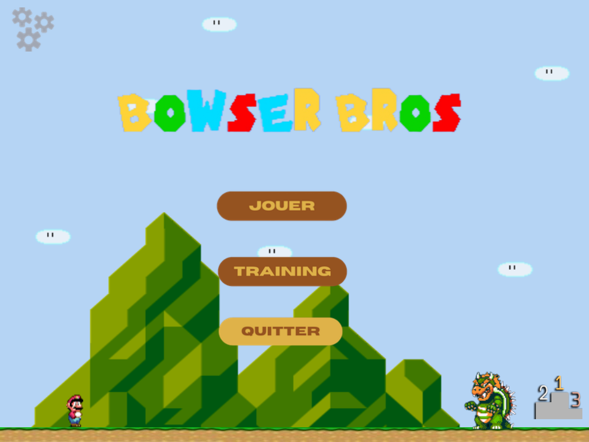
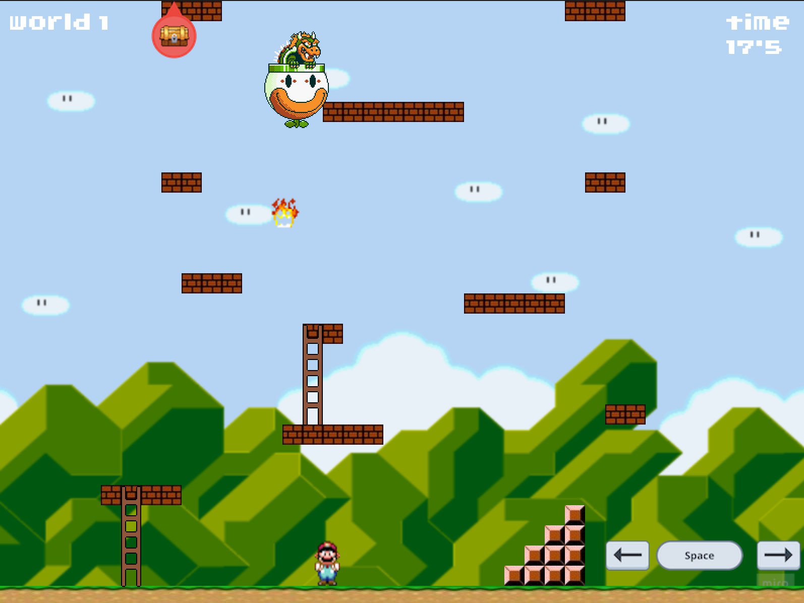
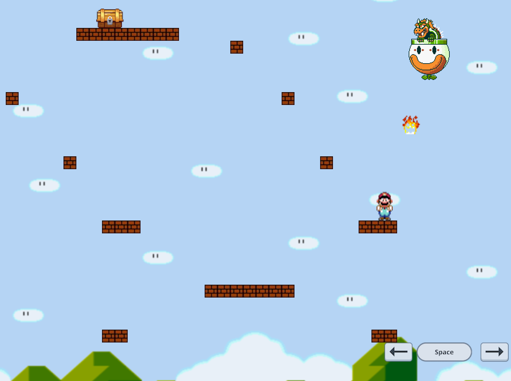
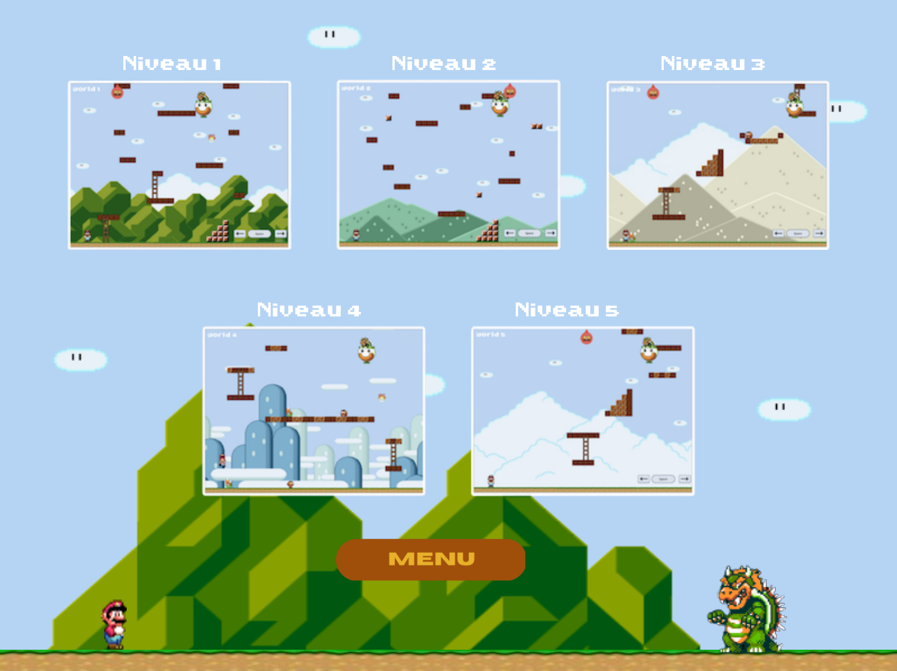
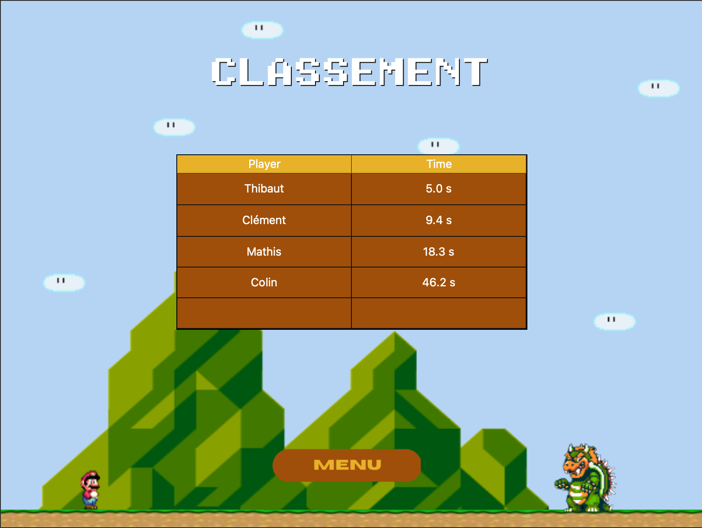
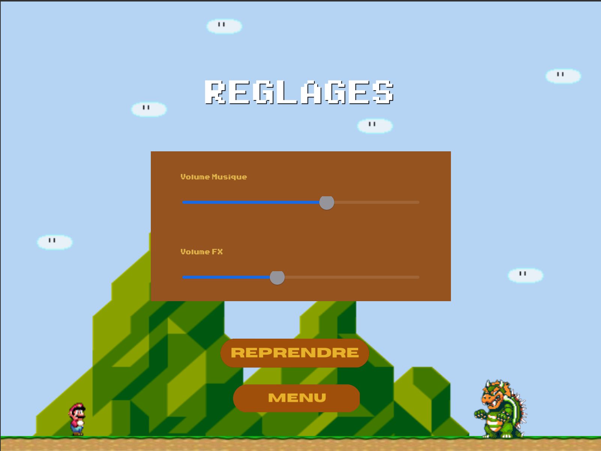
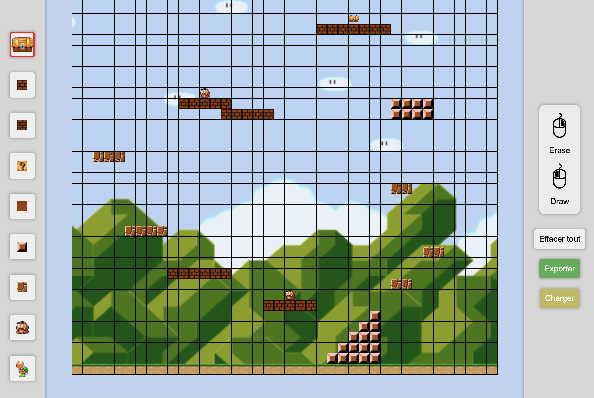

 
# RG23-D21 | Bowser Bros. 

<div align="center">
  
</div>

## Présentation du Projet BowserBros - SAE Retro Gaming

---

> **BowserBros** est un projet de développement d'une application de jeu de plateforme en C++ avec Qt Creator. Ce projet est réalisé dans le cadre de la première année du BUT Informatique de La Rochelle. Pour de précisions sur le projet, veillez à consulter le **Wiki** sur GitLab.

---


### *Arborescence*

```
├───BowserBros
│   ├───App
│   │   ├───Assets
│   │   │   ├───background
│   │   │   ├───block
│   │   │   ├───bowser
│   │   │   ├───mario
│   │   │   ├───menu
│   │   │   ├───other
│   │   │   └───score
│   │   ├───Fonts
│   │   ├───Levels
│   │   └───Song
│   ├───TestBowser
│   ├───TestElement
│   ├───TestEntity
│   └───TestMario
|
├───Database
├───Settings
|
├───Documents
├───Executable
|
├───Doxygen
│   ├───html
│   └───latex
│           
├───Images
└───Map-Designer
    ├───background
    ├───block
    └───other
```

---

### *Répertoires*

- **`/BowserBros`** : Application principale du projet. Contient le code source de l'application.
- **`/Doxygen`** : Documentation du projet. Contient la documentation du projet générée par Doxygen que vous pouvez consulter [ici](https://tlefranc.forge-pages.iut-larochelle.fr/RetroG23_BowserBros).
- **`/Executable`** : Exécutable du projet. Contient les exécutables de l'application pour Mac OS et Windows.
- **`/Images`** : Images utilisées dans le README.
- **`/.gitlab-ci.yml`** : Fichier de configuration de GitLab CI. Permet la mise en ligne de la documentation du projet.
- **`/Map-Designer`** : Dossier contenant le site HTML/CSS/JS permettant de créer/modifier des niveaux pour le jeu.
- **`/Database`** : Dossier contenant le fichier JSON de la base de données du jeu.
- **`/Settings`** : Dossier contenant le fichier .txt permettant de stocker les volumes des sons du jeu.

---

### *Installation*

- **Prérequis** : Avoir installé `QtCreator` si vous voulez le compiler vous même.

- **Installation** : Pour installer le projet, il suffit de cloner le projet sur votre machine et d'ouvrir le projet `BowserBros.pro` avec `QtCreator`. Vous pouvez ensuite compiler le projet et l'exécuter.  
Vous pouvez également lancer le fichier exécutable `BowserBros.exe` dans le répertoire `/Executable` pour Windows ce qui se chargera d'installer les librairies nécéssaires ou simplement `BowserBros.app` pour Mac OS.

---

### *Présentation de l'application*

L'application est un jeu de plateforme du style **Mario Bros**. Le but du jeu est de monter verticalement dans le niveau en évitant les boules de feu de **Bowser** afin d'atteindre un coffre qui mets fin au niveau.

- La version actuelle du projet dispose d'un menu et de 5 niveaux différents, le joueur à également la possibilité de modifier le volume dans les paramètres.
- Le jeu dispose également d'un mode entrainement permettant de tester les différents niveaux du jeu.

#### Images 

- **Menu principal**

Menu principal de l'application. Permet de choisir entre jouer, voir le classement ou quitter l'application.

<div align="center">
  
</div>

- **Début du niveau**

Etat du niveau au début de la partie.

<div align="center">
  
</div>

- **Haut du niveau**

Etat du niveau lorsque le joueur est monté dans le niveau.

<div align="center">
  
</div>

- **Mode Training**

Mode Entrainement permettant de tester les différents niveaux du jeu.

<div align="center">
  
</div>

---

- **Classement**

Affichage du top 5 du jeu et proposition d'inscription.

<div align="center">
  
</div>

- **Réglages**

Menu de réglages pour modifier les volumes des sons du jeu. (Marche également lors de la pause du jeu avec appui sur la touche `ECHAP`)

<div align="center">
  
</div>

---

- **Map Editor**

Site HTML/CS/JS permettant de créer des niveaux pour le jeu.

<div align="center">
  
</div>


---

